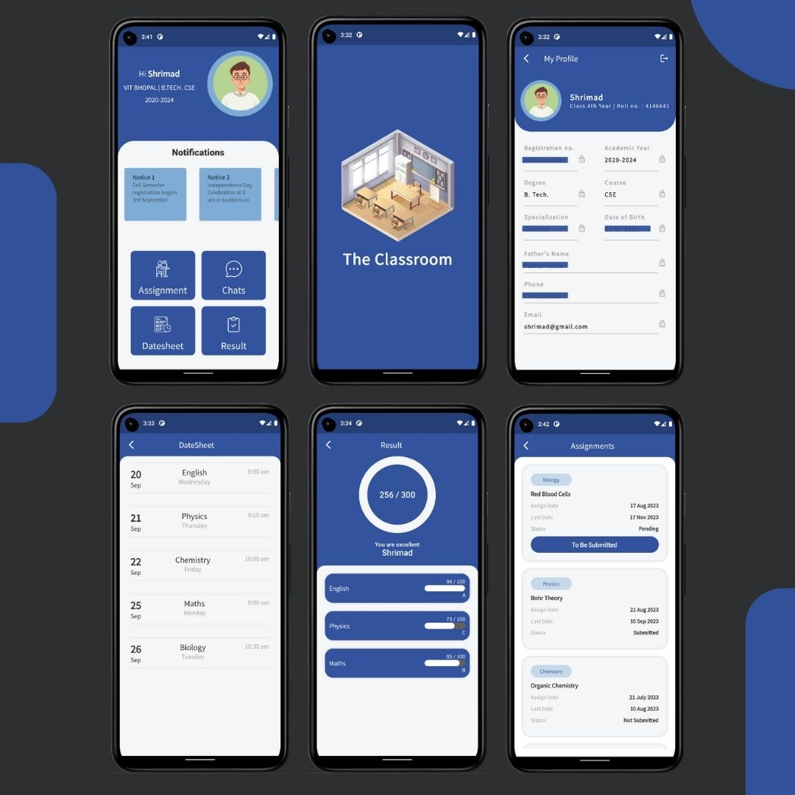
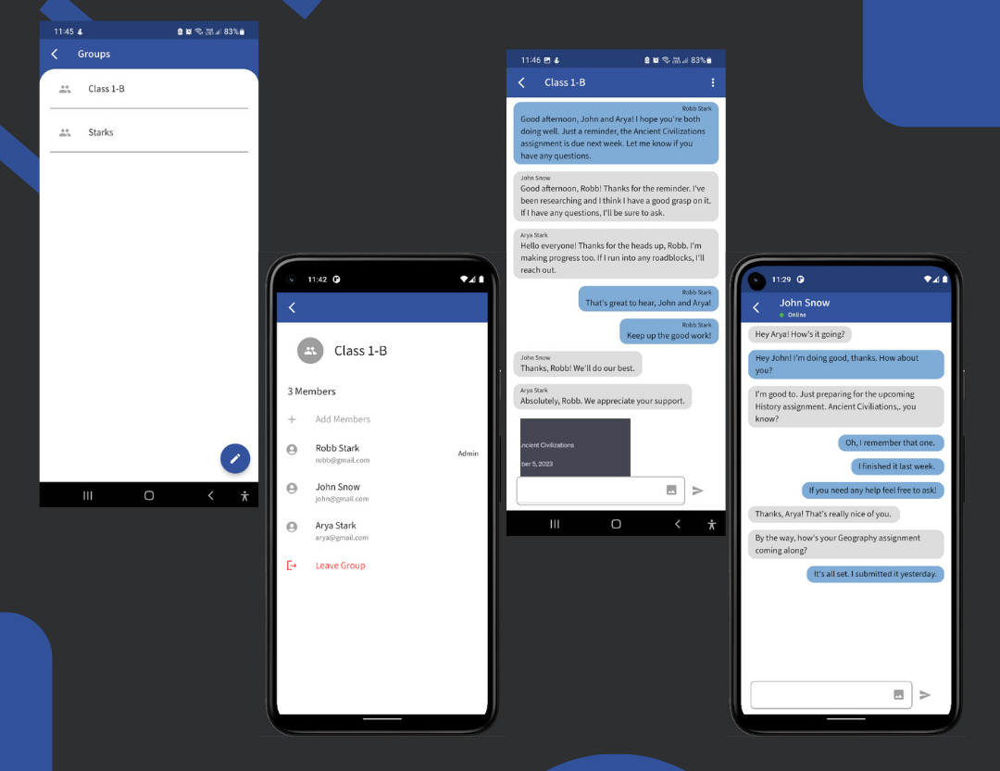

# The Classroom
> An app that connects students and teachers on a single platform, combining features
from different apps into one easy-to-use interface

  

### Download the app now  :  [The Classroom APK](https://github.com/Shrimad-Bhagwat/The-Classroom/releases/download/v1.0.0/the_classroom.apk)

The Classroom is a mobile application developed using Flutter and Firebase. It serves as a platform connecting students and teachers, offering a streamlined interface with features from various educational apps.

The application is designed with a simple and user-friendly interface that enables students to easily navigate through the app's features. 





### [Demo Video](https://youtu.be/GHizCVvIlr4)

## Usage example

This app can be used by students and professors to communicate properly and simplify all the tasks.

## Development setup

Requirements 
- Android Studio 

1. Fork this repository to your profile
2. Clone it to your device using

```
git clone https://github.com/<YOUR PROFILE>/The-Classroom.git
```
3. Start working 


## Contributing

1. Fork it (<https://github.com/Shrimad-Bhagwat/The-Classroom.git>)
2. Create your feature branch (`git checkout -b feature/<feature-name>`)
3. Commit your changes (`git commit -am 'Add <feature-name>'`)
4. Push to the branch (`git push origin feature/<feature-name>`)
5. Create a new Pull Request

